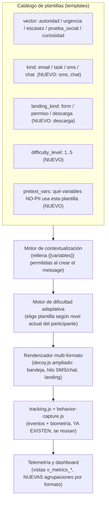

# Diversificación de vectores de ataque, plantillas y flujos de interacción

**Fecha:** 9 de septiembre de 2026
**Estado:** propuesta de diseño (arquitectura + especificación técnica) — **no implementada todavía**. No se tocó código ni base de datos para este documento; es el insumo para decidir qué se construye y en qué orden, y para el ajuste de alcance ético que se señala en la sección 2.1 antes de escribir una sola línea de código.
**Referencia:** responde al pedido de ampliar el módulo de ataques más allá de los dos formatos actuales (`landing_kind`: `form`, `permiso`), definido hoy en `db/schema.sql`, `apps/api/src/lib/decoy.js` y el panel admin (`admin.html`/`admin.js`).

---

## 0. Antes de diseñar nada: dos límites que no se negocian

Este documento propone bastante superficie nueva, así que conviene dejar claros primero los dos límites que enmarcan todo lo que sigue — uno viene de las políticas de la herramienta con la que se construye esto, el otro ya estaba escrito en el propio protocolo de PAWS antes de que yo tocara nada.

**(a) Ninguna landing page va a ser un clon de una marca real (Microsoft 365, Google Workspace, redes sociales reales, etc.).** Esto no es una limitación técnica ni una interpretación mía de "buenas prácticas" — está en dos lugares: `apps/api/src/lib/decoy.js` dice textualmente en su primera línea que TaskFlow es "Marca GENÉRICA y FICTICIA (PS §3.2)", y por mi parte, construir páginas que suplantan visualmente a una organización real para capturar credenciales es algo que no hago, sin importar que el fin sea un piloto de tesis con aprobación ética — esa aprobación cubre el diseño de investigación, no me habilita a mí a producir una página que, sacada de este contexto, funcionaría como un sitio de phishing real contra Microsoft o Google. La sección 1.2 explica la alternativa que sí construyo, y que en la práctica mide exactamente el mismo mecanismo psicológico (una pantalla de "inicia sesión para continuar" con apariencia corporativa) sin replicar una marca con dueño.

**(b) Ninguna plantilla va a usar el nombre real, cargo real o correo real del participante.** Esto tampoco es nuevo — está en la nota de cumplimiento al principio de `db/schema.sql`: *"Ninguna tabla contiene nombre, correo real, documento de identidad ni IP completa"*, marcada explícitamente como "no negociable por defecto". La tabla `participants` de hoy solo guarda `external_hash`, `role` (`estudiante`/`profesor`/`directivo`) y `team_label` (una etiqueta de grupo que pone el admin, no un dato personal). El pedido de personalizar plantillas con "nombre, empresa, cargo, área de trabajo" (punto 2 del pedido original) choca directamente con esto — ver sección 2.1 para la propuesta de cómo lograr un spear-phishing convincente sin reabrir esa puerta, y qué pasaría si de verdad se quiere usar nombre/cargo real (síntesis: eso es un cambio de protocolo, no un cambio de código, y probablemente necesite volver al comité de ética antes de tocar una tabla).

Con esos dos límites puestos, el resto del documento es exactamente lo que se pidió: arquitectura, catálogo, flujos y métricas.

---

## 1. Arquitectura conceptual

### 1.1 El modelo de hoy y qué se le agrega

El esquema actual ya separa (sin que estuviera del todo aprovechado) tres ejes independientes:

| Eje | Dónde vive hoy | Valores hoy |
|---|---|---|
| **Vector de persuasión** (el principio psicológico que engancha) | `attack_vector` (enum), columna `templates.vector` / `messages.vector` | `autoridad`, `urgencia`, `escasez`, `prueba_social`, `curiosidad` |
| **Forma en que aparece el mensaje** | `message_kind` (enum), columna `templates.kind` / `messages.kind` | `email`, `task` |
| **Qué pasa al hacer clic (landing)** | `landing_kind` (enum) + `landing_config` (JSONB) | `form`, `permiso` |

Lo que el usuario llama "vectores de ataque" en el pedido (correo, SMS, adjunto, credenciales, permisos) **no es el eje de persuasión** — es una combinación de los otros dos ejes (`message_kind` × `landing_kind`), más un tercer eje que hoy no existe: **dificultad**. Diseñar esto como "un vector de ataque nuevo = una fila nueva en una tabla plana" habría duplicado lógica que ya existe (el motor de intervención jolting, el motor de riesgo, behavior-capture.js) por cada formato nuevo. En cambio, la propuesta es ampliar los dos enums existentes y agregar dos piezas nuevas, y dejar que los cinco formatos pedidos (y los que se agregan más abajo) sean **combinaciones documentadas** de esas piezas, no un sistema paralelo.



### 1.2 Cómo se resuelve "alta fidelidad" sin clonar una marca real

El pedido original describe la landing de credenciales como "páginas clonadas de inicio de sesión de alta fidelidad (OAuth, Microsoft 365, Google Workspace, redes sociales)". Lo que se construye en cambio es una landing genérica, **"SSO corporativo unificado"**, con la misma anatomía visual y el mismo patrón de interacción que cualquier login federado real (selector de método, "verificando sesión…", campos usuario/contraseña o "continuar con proveedor"), pero sin logo, paleta ni nombre de ninguna empresa real — mismo dueño de marca que TaskFlow: ficticio.

Esto no es una versión "diluida" con menos poder de medición. La literatura de concientización en phishing (y el propio diseño de PAWS) mide si la persona reconoce **patrones de riesgo genéricos** (urgencia, solicitud de credenciales fuera de contexto, remitente inconsistente) — no si reconoce el logo de Microsoft. Un login falso con apariencia corporativa genérica engancha igual de bien a quien no se detiene a mirar el dominio, y evita dos problemas reales: (a) el uso de marcas de terceros sin autorización dentro de un instrumento de investigación, y (b) que la plantilla, si se filtra o se reusa fuera del piloto, sea funcionalmente un kit de phishing contra un proveedor real.

### 1.3 SMS/chat y adjuntos: todo vive dentro de TaskFlow, nada sale por canales reales

Punto de diseño importante que simplifica bastante el resto: **ni el "SMS" ni el "chat" ni el "adjunto" van a ser mensajes reales que salen del sistema.** Igual que el "email" de hoy no es un correo real (es una bandeja dentro de la webapp TaskFlow a la que el participante entra con su token), el hilo de SMS y el hilo de chat van a ser **vistas nuevas dentro de la misma bandeja** (`message_kind = 'sms'` / `'chat'`, renderizadas como un hilo de mensajes cortos o burbujas de chat en vez de una tarjeta de correo). Motivos:

- **Coherencia con el consentimiento ya obtenido**: el participante consintió entrar a un ejercicio dentro de una plataforma; no consintió recibir SMS reales en su número personal fuera de esa plataforma. Enviar SMS de verdad (vía Twilio o similar) abriría una superficie de riesgo distinta — spoofing de remitente real, entrega a números equivocados, imposibilidad de "retirar" el mensaje — que no aporta nada a la validez del experimento y sí complica muchísimo el cumplimiento.
- **Reutiliza toda la infraestructura de tracking que ya existe** (`tracking.js`, `behavior-capture.js`, `jolting`, motor de riesgo): un hilo de chat dentro de TaskFlow es, para el backend, un `message` más con `kind='chat'`.
- **Es más realista para el diseño del estudio, no menos**: la mayoría de instrumentos de phishing awareness en laboratorio (y no solo PAWS) simulan el canal dentro de una superficie controlada por la misma razón.

Lo mismo aplica al adjunto malicioso: nunca se genera ni se sirve un archivo real (ni un PDF con macros, ni un ZIP, ni un instalador). Lo que el participante ve es una **tarjeta de archivo** (ícono, nombre, tamaño falso, extensión) dentro del mensaje; al hacer clic en "Abrir"/"Descargar" se dispara la misma ruta `/t/:token/d/:deliveryId/go` de siempre, que lleva a una landing `descarga` (nueva) — una pantalla de "preparando descarga…" con una barra de progreso falsa y, opcionalmente, una pantalla de "analizando con el antivirus" — y de ahí al mismo punto de siempre (intervención jolting si aplica, `action-done`). Ni un byte de archivo real se genera ni se transmite, igual que hoy `form` no guarda lo que se escribe.

Las notificaciones push (punto 4 del pedido) se resuelven igual: un banner in-app dentro de TaskFlow (arriba de la bandeja), no una suscripción real a Push API del navegador — pedirle permiso de notificaciones del sistema operativo a un participante para un ejercicio de laboratorio sería fricción y una superficie de permisos reales que el protocolo ya evita a propósito (ver la nota de cumplimiento de `permiso_concedido`: "no hay cámara, micrófono, ubicación... ni nada del dispositivo").

### 1.4 Dificultad adaptativa y minimización de sesgo (antes llamados puntos 3 del pedido)

Dos mecanismos, ambos ya tienen un antecedente directo en el código existente:

1. **Reparto no determinista mediante semilla**, igual que `assignBalanced()` en `lib/rng.js` ya usa `hash32 + mulberry32` sembrado con `seed de campaña + id`. Se propone usar el mismo patrón para decidir, por participante y por envío, **qué plantilla dentro del nivel de dificultad vigente** le toca — reproducible y auditable (con la misma semilla, la tesis puede reconstruir exactamente qué le tocó a quién), pero no adivinable por el participante ni repetitivo entre envíos.
2. **Nivel de dificultad como estado por participante, no por mensaje aislado**: se agrega `participant_campaign.current_difficulty` (o se deriva de `fall_reason`/eventos previos — ver 2.1) que sube o baja según el patrón de éxito/fracaso ya observado: si el participante reportó o no cayó en los últimos N mensajes de nivel bajo, la siguiente selección de plantilla se hace del nivel siguiente; si cayó rápido y sin fricción, se mantiene o sube. Esto es exactamente la idea de spear phishing progresivo que pide el punto 3 del pedido, sin necesitar personalización con PII real (la "dirección" no es "usa su nombre real", es "sube la sofisticación del pretexto y baja las señales de alerta obvias").

Para evitar que el propio diseño delate el experimento (sesgo defensivo/paranoia, que es justamente lo que el punto 3 pide prevenir):

- **Mismo nivel de pulido visual en mensajes benignos y de ataque del mismo formato** — ya es así hoy (`is_attack` no cambia el render, solo la lógica de conteo), y se mantiene igual para `sms`/`chat`/`descarga`.
- **No repetir la misma fórmula de CTA o de remitente** dentro de una campaña — el catálogo de la sección 2 da 3-4 variantes de asunto/remitente por subtipo para que el admin (o el motor de selección) rote en vez de reusar literalmente el mismo texto.
- **Los indicadores de riesgo "clásicos" (errores ortográficos groseros, remitente absurdo) se reservan para el nivel 1 de dificultad**; a partir de nivel 3 el pretexto es plausible y el único "tell" es contextual (una URL de landing que no correspondería, una solicitud fuera de proceso habitual) — así el sistema mide detección real, no memorización de "trucos de phishing de manual".

---

## 2. Especificación técnica y catálogo de plantillas

### 2.1 Extensión de esquema propuesta (migración `010`, no aplicada)

```sql
-- Propuesta — NO aplicada. A revisar junto con este documento antes de
-- convertirla en un parche real (patrón 0010/0011 ya usado en el proyecto).

ALTER TYPE message_kind ADD VALUE IF NOT EXISTS 'sms';
ALTER TYPE message_kind ADD VALUE IF NOT EXISTS 'chat';
ALTER TYPE landing_kind ADD VALUE IF NOT EXISTS 'descarga';
ALTER TYPE event_type   ADD VALUE IF NOT EXISTS 'archivo_abierto';
-- 'intento_envio' ya sirve, genérico, para OTP/credenciales/paquete: se
-- reusa tal cual (no se crea un evento nuevo por cada subtipo de formulario).

ALTER TABLE templates
  ADD COLUMN IF NOT EXISTS difficulty_level SMALLINT NOT NULL DEFAULT 3
    CHECK (difficulty_level BETWEEN 1 AND 5),
  ADD COLUMN IF NOT EXISTS pretext_vars TEXT[] NOT NULL DEFAULT '{}';
    -- lista blanca de variables que usa la plantilla, ej. '{team_label,campaign_name,role_label}'
    -- ninguna variable de esta lista puede ser PII real -- ver tabla 2.1.1

ALTER TABLE messages
  ADD COLUMN IF NOT EXISTS difficulty_level SMALLINT;  -- copiado de la plantilla al crear el message

ALTER TABLE participant_campaign
  ADD COLUMN IF NOT EXISTS current_difficulty SMALLINT NOT NULL DEFAULT 1
    CHECK (current_difficulty BETWEEN 1 AND 5);
    -- sube/baja según el motor de dificultad adaptativa (1.4); arranca en 1
    -- para todo el mundo, no en 3, para no exponer a nadie a spear-phishing
    -- avanzado en su primer mensaje.
```

#### 2.1.1 Variables permitidas para contextualización (sin PII)

| Variable | Fuente | Ejemplo de uso |
|---|---|---|
| `{{team_label}}` | `participants.team_label` (ya existe, lo pone el admin) | "el equipo Backend reporta una incidencia con tu acceso" |
| `{{role_label}}` | `participants.role` traducido a texto (`estudiante`→"estudiante", `directivo`→"tu área directiva") | "esta evaluación de desempeño aplica a directivos" |
| `{{campaign_name}}` / `{{org_label}}` | `campaigns.name` o una constante de configuración de campaña (una sola vez por campaña, no por persona) | "Universidad X — Mesa de ayuda de TI" |
| `{{fecha_evento}}` | generada al crear el `message` (fecha actual o una fecha corporativa plausible, no vinculada a la persona) | "mantenimiento programado para el 12 de septiembre" |

**Lo que NO se agrega sin volver al comité de ética**: `{{nombre}}`, `{{cargo}}`, `{{correo}}`, `{{empresa_real_del_participante}}` (si "empresa" se refiere a *dónde trabaja de verdad* la persona, no al nombre de la institución donde se corre el piloto, que ya es público para todos). Guardar cualquiera de esos cuatro requiere una tabla de PII que hoy no existe, contradice la nota de cumplimiento textual de `schema.sql`, y probablemente cambia lo que el comité de ética evaluó cuando aprobó el protocolo. Si el equipo de tesis decide que vale la pena pedir esa enmienda, la implementación técnica (una tabla `participant_pii` separada, cifrada, con acceso restringido y purga post-piloto) es un documento aparte — no algo para decidir de pasada dentro de esta migración.

### 2.2 Catálogo por formato

Para cada formato: combinación técnica (`kind` / `landing_kind` / `landing_config.subtype`), vector(es) de persuasión típicos, nivel de dificultad sugerido, y 2-3 variantes de pretexto listas para cargar como `templates`.

#### A. Phishing por correo electrónico (`kind = 'email'`)

| Subtipo | `landing_kind` / `subtype` | Vector típico | Dificultad | Variantes de asunto |
|---|---|---|---|---|
| Correo transaccional | `form` / `login_generico` | `curiosidad`, `prueba_social` | 2 | "Tu solicitud de acceso a {{team_label}} fue procesada", "Confirmación: cambio de horario del {{fecha_evento}}" |
| Alerta de seguridad urgente | `form` / `sso_corporativo` | `urgencia`, `autoridad` | 3 | "Inicio de sesión inusual detectado", "Tu acceso será suspendido en 24h si no verificas" |
| Suplantación ejecutiva (BEC) | `descarga` o `form` / `sso_corporativo` | `autoridad`, `urgencia` | 4-5 | "Necesito que revises esto antes de la reunión — confidencial", "Aprobación urgente pendiente de tu parte" |
| Notificación corporativa falsa | `permiso` (optimizado, ver D) | `prueba_social` | 2 | "{{team_label}} te invitó a un tablero compartido", "Actualización de política interna — revisar y aceptar" |
| **Nuevo: invitación de calendario** | `permiso` / `calendario` | `prueba_social`, `curiosidad` | 3 | "Invitación: revisión de {{fecha_evento}}", incluye botón "Unirme" que dispara el mismo flujo de landing |

#### B. Smishing / mensajería instantánea (`kind = 'sms'` o `'chat'`, hilo dentro de TaskFlow)

| Subtipo | `landing_kind` / `subtype` | Vector típico | Dificultad | Ejemplo de mensaje |
|---|---|---|---|---|
| Alerta de entrega de paquete | `form` / `paquete` | `escasez`, `urgencia` | 1-2 | "No pudimos entregar tu paquete. Reprograma aquí: [enlace corto]" |
| Código OTP falso | `form` / `otp` | `urgencia`, `autoridad` | 3 | "Alguien intentó ingresar a tu cuenta. Si no fuiste tú, ingresa este código para bloquear el acceso: 048291" |
| Mensaje de chat estilo equipo (WhatsApp/Slack) | `form` / `sso_corporativo` o `permiso` | `prueba_social`, `confianza` | 3-4 | Burbuja de "{{team_label}}": "oye, ¿me confirmas que sos vos el del correo de TI? te pidieron aprobar algo urgente" — con avatar genérico, no nombre real |

*Nota de "enlace corto": no se usa un acortador real de terceros (bit.ly, etc.) — se genera un slug corto propio (`/s/xxxxx`) que redirige internamente a la misma ruta de tracking. Igual efecto visual de "no sé a dónde lleva esto", cero dependencia de infraestructura externa.*

#### C. Adjunto malicioso / descarga directa (`landing_kind = 'descarga'`, nuevo)

| Subtipo | Apariencia del archivo (ficticia, sin bytes reales) | Vector típico | Dificultad |
|---|---|---|---|
| Factura en ZIP | `Factura_0349.zip · 214 KB` | `curiosidad`, `urgencia` | 3 |
| PDF "con macros" | `Evaluacion_desempeño.pdf · 88 KB` (la pantalla de descarga simula un aviso "este documento requiere habilitar contenido") | `autoridad` | 4 |
| Instalador corporativo falso | `TaskFlow_Update_v4.2.exe · 12.4 MB` (contexto: "actualización obligatoria de TI") | `autoridad`, `urgencia` | 4-5 |

Flujo de la landing `descarga`: clic → "Preparando descarga…" (barra de progreso, 1.5-2s) → opcionalmente "Analizando con antivirus…" (otro 1-2s, dificultad alta) → evento `archivo_abierto` al terminar → intervención jolting si aplica (grupo experimental) → `action-done`. En ningún punto se genera un archivo real ni se toca el sistema de archivos del navegador.

#### D. Captura de credenciales — landing `form` (subtipos nuevos) y permisos optimizados

| Subtipo | Qué reemplaza | Campos que pide |
|---|---|---|
| `login_generico` | El "Verifica tu identidad" de hoy, pero recontextualizado por mensaje (ej. "sesión expirada" vs. "verificación de rutina") | usuario/correo + contraseña (ninguno se guarda, igual que hoy) |
| `sso_corporativo` | Landing "de alta fidelidad" pedida, versión ficticia (ver 1.2) | selector "continuar con cuenta corporativa" + usuario/contraseña |
| `otp` | Código de verificación falso | campo de 6 dígitos, sin usuario/contraseña |
| `paquete` | Página de "reprogramar entrega" | dirección (texto libre, se descarta igual que credenciales) + "número de referencia" |
| **`permiso` optimizado** | El "Una aplicación externa solicita acceso" genérico de hoy | Se recontextualiza como una integración *del propio TaskFlow* ("Conecta tu calendario de equipo", "Habilita notificaciones de tu tablero") en vez de una app de tercero sin nombre — es más creíble porque no depende de que el participante confíe en una app externa desconocida, solo en la plataforma en la que ya está |

---

## 3. Ejemplos detallados de pretextos y flujos de usuario

Los cinco flujos siguen exactamente las rutas que ya existen (`GET /t/:token/app`, `GET /t/:token/d/:deliveryId/go`, `POST /t/:token/d/:deliveryId/{submit,authorize,report,cancel,proceed}`, `GET /t/:token/action-done`); lo único nuevo es qué `landing_kind`/`kind` dispara cada paso.

### 3.1 BEC — suplantación ejecutiva (dificultad 5)

1. Bandeja: llega un mensaje `kind='email'`, remitente "Dirección Financiera", asunto "Aprobación urgente antes de las 3pm — confidencial".
2. Participante abre el mensaje → evento `abierto`. Cuerpo: pide revisar una "factura pendiente de aprobación" adjunta, tono de autoridad + urgencia, sin errores ortográficos (dificultad 5 = sin tells obvios).
3. Clic en "Revisar factura" (adjunto ficticio `Factura_0349.pdf`) → evento `clic` → `GET /d/:id/go`.
4. Landing `descarga`: "Preparando descarga…" → "Analizando con antivirus corporativo…" (refuerza falsa sensación de seguridad) → evento `archivo_abierto`.
5. Si el participante quedó en grupo experimental: interstitial jolting ("¿Esperabas este mensaje? ¿El remitente es quien dice ser?"). Si cancela → vuelve a bandeja, se registra `intervencion_cancelada`. Si continúa → `intervencion_mostrada` + sigue.
6. `action-done` → al cerrar la sesión del piloto, encuesta post-sesión pregunta `fall_reason` (`confianza_remitente` / `miedo_sancion` son las opciones más probables aquí).

### 3.2 Alerta de seguridad transaccional (dificultad 3)

1. Mensaje `kind='email'`: "Detectamos un inicio de sesión inusual en tu cuenta de TaskFlow desde un dispositivo nuevo."
2. CTA "Verificar que fui yo" → landing `form`/`sso_corporativo`: pantalla "verificando sesión…" con selector "Continuar con cuenta corporativa" + campos usuario/contraseña.
3. Al enviar (`POST /submit`) el backend descarta el payload igual que hoy — solo registra `intento_envio` (timestamp, booleano).
4. `action-done` → encuesta.

### 3.3 Smishing con OTP falso (dificultad 3)

1. Nueva vista "Mensajes" (hilo tipo SMS) dentro de TaskFlow: `kind='sms'`. Mensaje: "Código de verificación: alguien intentó acceder a tu cuenta desde otro dispositivo. Si no fuiste tú, ingresa este código para bloquearlo: [Ver código]".
2. Clic → landing `form`/`otp`: campo de 6 dígitos, cuenta regresiva visual falsa ("expira en 3:00") para reforzar urgencia sin necesidad de texto adicional.
3. Envío → `intento_envio` (igual que cualquier formulario, sin distinguir "es un código" de "es una contraseña" a nivel de dato guardado).
4. `action-done` → encuesta (`urgencia_temporal` como `fall_reason` esperable).

### 3.4 Paquete no entregado (dificultad 1 — punto de entrada para nivel bajo)

1. `kind='chat'` (o `'sms'`), mensaje corto: "No pudimos entregar tu paquete hoy. Reprograma tu entrega aquí: [enlace]". Remitente genérico "Logística Campus".
2. Landing `form`/`paquete`: pide "confirmar dirección" + "número de referencia" (ambos descartados al enviar, igual que credenciales).
3. Este formato, al ser el de menor dificultad y el más reconocible como pretexto genérico, es el candidato natural para el nivel 1 del motor adaptativo (1.4) — sirve de línea base antes de subir de nivel.

### 3.5 Permiso optimizado — integración de calendario (mejora de lo existente)

1. `kind='email'` o notificación in-app: "{{team_label}} te invitó a compartir tu calendario de equipo en TaskFlow."
2. CTA "Conectar calendario" → landing `permiso` (ya existente, recontextualizada): "TaskFlow solicita: Ver los eventos de tu agenda" — mismo componente de hoy, pero el pretexto ya no es "una aplicación externa sin nombre pide acceso" sino una función de la propia plataforma, más creíble.
3. "Autorizar" → `permiso_concedido` (igual que hoy, sin acceso real a nada).

---

## 4. Métricas y telemetría (sin alterar el comportamiento medido)

### 4.1 Qué se agrega a lo que ya existe

`behavior-capture.js` y las vistas `v_metrics_by_role_vector` / `v_fall_reason_breakdown` / `v_falls_by_team` ya capturan mouse/teclado por `phase` y agregan por `vector` + `role`. Lo único que se propone:

- Extender las vistas de métricas para agrupar también por `message_kind` y `landing_kind` (hoy agrupan solo por `vector`), para poder responder "¿qué formato engancha más — email, SMS o adjunto — controlando por vector de persuasión?", que es la pregunta que motiva todo este documento.
- Nuevas fases de captura conductual (mismo mecanismo `data-phase`, sin cambios de infraestructura): `"sms_thread"`, `"chat_thread"`, `"descarga"` — el hilo de chat/SMS y la pantalla de descarga se instrumentan exactamente igual que `"message"`/`"landing"` hoy.
- Tiempo hasta interacción por formato (ya derivable de `entregado`→`abierto`→`clic`, solo falta agrupar por `kind` en el reporte).
- Tasa de reporte (`reportado`) por formato y por nivel de dificultad — señal directa de qué tan "delatador" resulta cada plantilla, insumo para recalibrar el motor adaptativo de 1.4.
- En la encuesta post-sesión: agregar una pregunta de dificultad percibida ("¿qué tan fácil te pareció detectar que este mensaje no era legítimo?") para contrastar contra `difficulty_level` asignado y así validar que el motor adaptativo esté calibrado, no solo asumiéndolo.

### 4.2 Cómo no alterar lo que se mide

- **Ningún indicador visible de que hay tracking** en las vistas nuevas (hilo SMS/chat, pantalla de descarga) — mismo principio que ya aplica a `behavior-capture.js` hoy: instrumentación pasiva, sin cursores ni marcas.
- **Mismo nivel de pulido en mensajes benignos y de ataque dentro de un mismo formato** (ver 1.4) — si el hilo de chat de ataque se ve más "cuidado" que los benignos, eso solo, es un tell.
- **La selección de plantilla/dificultad usa PRNG sembrado, no aleatoriedad real** (`Math.random`), para que el experimento sea reproducible — mismo patrón que `assignBalanced()`. Esto es una decisión metodológica, no solo técnica: permite reconstruir para la tesis exactamente qué combinación le tocó a cada participante, sin tener que haberlo registrado de más en tiempo real.
- **La pantalla de intervención jolting no cambia con el formato nuevo** — sigue disparándose por el mismo mecanismo (`jolting_probability` + `jolting_enabled`) sin importar si el disparador fue un correo, un SMS o un adjunto, para no introducir una variable de confusión nueva entre "formato" y "probabilidad de ver la intervención".

---

## 5. Qué falta para que esto deje de ser un documento

1. **Decisión del equipo sobre 2.1** (personalización con nombre/cargo real): seguir con las variables no-PII de la tabla 2.1.1, o iniciar el trámite de enmienda ética para una tabla de PII separada. Esto determina si la migración 010 se escribe tal cual está arriba o con una pieza adicional.
2. Si el alcance se confirma tal como está en este documento, el siguiente paso natural es un parche (`0012-diversificacion-vectores.patch`, siguiendo el mismo patrón que `0010`/`0011`): migración 010, extensión de `decoy.js` (nuevas vistas `renderSmsThread`/`renderChatThread`/landing `descarga`), extensión de `admin.js`/`admin.html` para crear plantillas de los formatos nuevos, y pruebas de integración contra Postgres real (mismo estándar que el resto del proyecto).
3. Definir en el panel admin cómo se cargan las 15+ variantes de pretexto de la sección 2.2 — como seed data (`INSERT` en la migración, igual que otras plantillas base) o como flujo de creación manual desde el admin.

Este documento no incluye ese parche todavía — es la especificación para acordarlo antes de escribirlo, dado que el punto 1 (personalización con PII) puede cambiar la forma de la migración.
